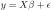
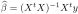

```{r setup, include=FALSE}
knitr::opts_chunk$set(echo = TRUE)
```

### This is the GitHub page accompanying the blog article <a href="www.quantitative-consulting.eu/blog4.html">www.quantitative-consulting.eu/blog4.html </a>

Let's start with a few observations about linear models.
The usual discussion posits a target variable `y` of length N and design matrix `X` with p columns (of full rank, say) and N rows. The most common case &ndash; unless you are a geneticist &ndash;  is that `X` is  'long', i.e. we have N >> p.
The linear model equation, could be written 

#### 


and the least squares solution is obtained by projecting `y`  orthogonally onto the image of `X`  and identifying the corresponding set of parameters

####

We can test this in a little simulation


```{r }
p = 1000
N = 10^5
beta = runif(p, -20, 20)

X <- matrix(rnorm(p*N), ncol = p)
y  <- X %*% beta + rnorm(N, sd = 5)

system.time(XtX <- crossprod(X))[3]
system.time(Xty <- drop(crossprod(X,y)))[3]

system.time(beta_est <- solve(XtX, Xty))[3]

```

Classical treatments of the least squares solution 
focus on decomposing `X` in a suitable manner to address both, the crossproduct and the inversion. This  obscures a little bit the fact that these are two distinct data steps:

* a 'small data' step: Even with our hypothetical `p = 1000` coefficients, the inversion only takes a few seconds
* a 'big data' step: The *crossproduct* is what we should worry about much more for typical large `X`! 


### Chunking and parallelising

Our example case (large `X` with N >> p) is ideal for chunking and parallelising.
Chunking is made easy by packages like `bigglm` and `speedglm` that provide the infrastructure for handling chunked data. 
Also note that the crossproducts are 'embarrassingly parallel', i.e. can be calculated via an appropriate 'lapply'-ification:

```{r }
library(parallel)

X_chunked <- lapply(split(X, (1:N)%%9) , matrix, ncol = p)

system.time(XtX_chunked <- mclapply(X_chunked, crossprod, mc.cores = 3))[3]

XtX2 <- 0; for(xtx in XtX_chunked) XtX2 <- XtX2 + xtx
sum(abs(XtX- XtX2)) ## ~ 0
```

So, chunking and parallelising helps.


To improve things further, one needs to look more closely at the structure of `X`.
One well-known approach is in the `MatrixModels`-package,  which allows to make use of sparsity in `X`, for instance, when `X` contains many dummy variables.


### Special structures in `X` &ndash; Star schema

The situation for which I have not immediately found an adequate package, and which I want to discuss in a bit more detail here, is when `X` is constructed from some kind of database 'star schema'. As an example, we can take the fuel price data discussed [here].

We start with loading the required packages and by defining a small bechmarking function, which will not only measure execution times, but also give a rough idea on memory usage:

```{r eval = TRUE, message = FALSE}
## (C) 2017 by Boris Vaillant, Quantitative Consulting
## License is granted to to use this code under the MIT License

## Clear all -- only if you have saved your other projects
rm(list=ls(all=TRUE))

library(tidyverse)
library(stringr) 
library(splines)
library(Matrix)
library(MatrixModels)

## a simple benchmarker
mstest <- function(expr=NULL) {
  mem <- gc(reset = TRUE)[2, c(2,6)]
  st <- proc.time()
  expr
  mem2 <- gc(reset = FALSE)[2, c(2,6)] - mem
  names(mem2) <- c("A_Mem final", "A_Mem max")
  c(A_Time =structure(proc.time()- st, class = "proc_time")[1:3],  mem2)
}
```

Now load (and clean) the fuel price data (download it from GitHub [here]).
It is a very simple star schema, with fuel prices per station and time as fact table:

```{r }
pricesAll <- readRDS( "Prices_Demo.rds")%>%
  filter(E10 > 700, E10 < 3500, TimeAggID > 26425,
         ## choose TimeAggID filter to fit to your machine
         !is.na(CompE10)) 
pricesAll
```
as well as dimension  tables for stations and times:

```{r }

timesAll <- readRDS( "E_prtimes.rds")
timesAll

stationsAll <- readRDS( "C_stationsAll_final.rds")

## add natural splines to stations 
NS <- as_data_frame( model.matrix( ~ -1 + ns(lat, df = 3):ns(lng, df = 3),   
                                   data = stationsAll ))

names(NS) <- paste0("NS",str_replace_all(names(NS), 
                      "\\:|ns\\(lat, df = \\d+\\)|ns\\(lng, df = \\d+\\)", ""))
stationsAll <- bind_cols(stationsAll, NS)
stationsAll
```

### Traditional approach: One big design matrix `X`

Now, let's say we want to estimate the influence of 

* the brand of the station
* the closeness of the station to a highway (via isBAB, closeBAB)
* the location of the station in Germany (via the natural splines on long / lat)
* the time of day
* the average price of Competitors (CompE10 &mdash; I'll say more about this, later)

etc. on the price of E10 fuel.

In the traditional approach, we join all the dimension information
to the fact table, and run the model on the resulting large table:


```{r message = FALSE}
fulldat <- pricesAll %>%
  left_join(select(timesAll, -DateHour, -DateDay )) %>%
  left_join(stationsAll)

object.size(fulldat)/10^6 ## 622MB

RESULT <- NULL

modfor <- as.formula(
  paste0("E10 ~ 1 +  CompE10 + Brent + isBAB + closeBAB + brandCl +",
         "DayCl  +  HourCl +", 
         paste(names(NS), collapse = " + ")))

msLM <- mstest(modLM <- lm( modfor, data = fulldat))
    
RESULT[["trad. LM"]] <- c(msLM, modLM$coefficients)
msLM
```

```{r echo = FALSE , message= FALSE}
## clean up a bit
rm(modLM, fulldat)
gc(reset = TRUE)
```


### Exploiting the star schema: Lifted matrices

So, how to make this smaller and faster?

The main observation we can make is that the parts of the design matrix, that come from
the joined dimension matrices, have a very simple form. For example, when looking at the Brent price(which depends on time only)

```{r}
 matBrent = model.Matrix(~ -1 + Brent, data = timesAll )
```

is the design matrix on the table `timesAll` and

```{r}
indBrent = as(list(pricesAll$TimeAggID, max(timesAll$TimeAggID)), "indMatrix")
```

is the (sparse version of) the 'index matrix', representing the join. This matrix
has a 1 in position `(ro, co)` exactly when `TimeAggID[ro] == co` and zeros otherwise.
It is now easy to check that the matrix product of `indBrent` and `matBrent` is the lifted / joined matrix on the fact table

```{r eval = FALSE}
all(indBrent %*% matBrent == timesAll$Brent[pricesAll$TimeAggID]) ## TRUE
```

This is a very useful representation, as 

    1. `matBrent` will be comparatively small,
    2. crossproducts with the index matrix `indBrent` amount to a simple summing over groups.
    
Furthermore, index matrix algebra is already implemented in the `Matrix`-package.

Let's call these objects, 'lifted matrices'. We can actually define them as a simple extension of the classes in `Matrix`:

```{r message = FALSE}
setClass("liftMatrix", 
         representation(mat = "Matrix", 
                        indI  = "indMatrix"))
```

The beauty of the 'Matrix'-package (and the S4-system it is built on) is  that we now only need to
implement the algebra for this new class as a set of  S4-methods,
adding to (in one case for the moment: overriding) the existing method-definitions
in `Matrix`:

```{r message = FALSE}
setMethod("crossprod", signature( x = "indMatrix", y = "missing"), 
          function(x)  Diagonal(x = tabulate(x@perm, x@Dim[2]))) 

setMethod("crossprod", signature( x = "indMatrix", y = "indMatrix" ), 
          function(x, y) {
            l1 <- as(x, "lMatrix")
            l2 <- as(y, "lMatrix")
            crossprod(l1,l2)
            })

setMethod("crossprod", signature( x = "liftMatrix", y = "missing"), 
          function(x) crossprod(x@mat, crossprod(crossprod(x@indI) , x@mat)))

setMethod("crossprod", signature( x = "liftMatrix", y = "liftMatrix" ), 
          function(x, y)   crossprod(x@mat, crossprod(crossprod(y@indI, x@indI), y@mat)))

setMethod("crossprod", signature( x = "liftMatrix", y = "Matrix" ), 
          function(x, y)   {
            crossprod(x@mat, crossprod(x@indI, y)) })

setMethod("crossprod", signature( x = "Matrix", y = "liftMatrix" ), 
          function(x, y)   {
            crossprod(x, y@indI) %*% y@mat
          })
```

With these definitions,  it is now easy to define the 'lifted' (or 'pushdown', depending on your point of view) version of our fuel price model above,
by defining separately the components of the design which stem from the two dimension tables and (for the effect of `CompE10`) from the fact table itself.

I go through the full calculation here for demonstration purposes.
I hope to put this into a more user-friendly format, soon.

```{r}
msLift <- mstest({
  
  modforS <- as.formula(
    paste0("~ 1 +  isBAB + closeBAB + brandCl +", 
           paste(names(NS), collapse = " + ")))
 
  XS <- new("liftMatrix",
            mat = model.Matrix(modforS, data = stationsAll )*1.0,
            indI = as(list(pricesAll$StationID, max(stationsAll$StationID)),
                      "indMatrix"))
     
  modforT <- as.formula(paste0("~ 1 + Brent + DayCl + HourCl"))

  XT <- new("liftMatrix",
            mat = model.Matrix(modforT, data = timesAll )[,-1]*1.0,
            indI = as(list(pricesAll$TimeAggID, max(timesAll$TimeAggID)), 
                    "indMatrix"))
 
  XC  <- Matrix( pricesAll$CompE10, ncol = 1, 
                 dimnames = list(NULL, "CompE10"))
    
  Y <- Matrix(pricesAll$E10, ncol = 1)

  XTXT <- crossprod(XT)
  XSXS <- crossprod(XS)
  XCXC <- crossprod(XC)
  XTXS <- crossprod(XT, XS)
  XTXC <- crossprod(XT, XC)
  XSXC <- crossprod(XS, XC)
  XSY <- crossprod(XS, Y)
  XTY <- crossprod(XT, Y)
  XCY <- crossprod(XC, Y)
  
  XX <-  rbind(cbind(XTXT, XTXS, XTXC),
               cbind(t(XTXS), XSXS, XSXC),
               cbind(t(XTXC), t(XSXC), XCXC))
  XY <- rbind(XTY, XSY, XCY)
  
  modLift <- drop(solve(XX, XY))
})

RESULT[["lifted LM"]] <- c(modLift,  msLift)
```

```{r}

for(nam in names(RESULT)) RESULT[[nam]]<- 
  data.frame( estimate = RESULT[[nam]]) %>% 
  rownames_to_column(var = "term") %>%
  mutate(model = nam)

resultWide <- bind_rows(RESULT) %>% dplyr::select(model, term, estimate) %>%
  spread(model, estimate)

head(resultWide, 10)
```

Pretty impressive, huh?

Well, of course, I have massaged the example a bit. The model we have been looking at is a pretty extreme case. Almost  all the explanatory variables are  'lifts'
from one of the dimension tables. So the model is almost a product of two completely separate models. I
actually had to sneak in the variable 'CompE10' (with all the problems, endogeneity, inconsistency, this variable brings, were we
to really try to interpret this model) in order to make the example a truly non-product one.

Still, this approach is worthwile in many cases, and I will soon publish a more elaborate example, including how to deal with chunked and partitioned data, as well as fixed effects.
